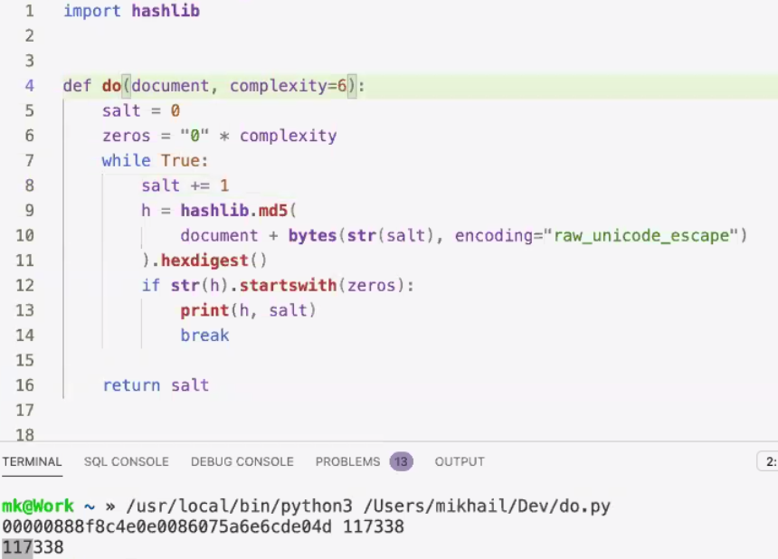
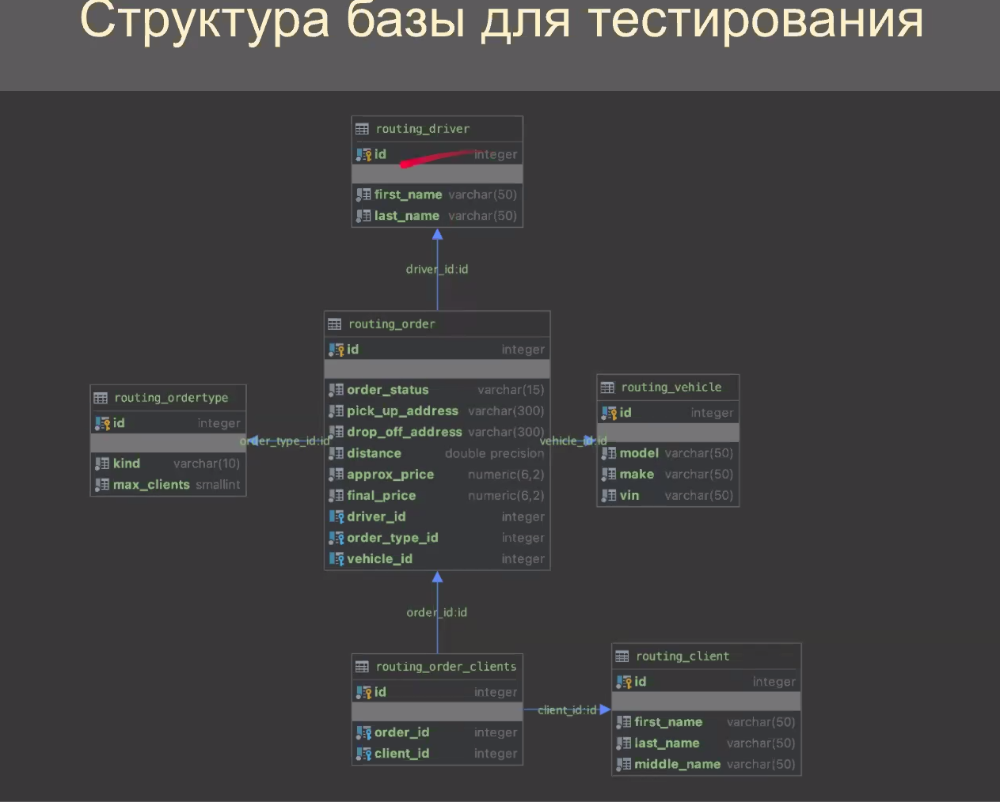
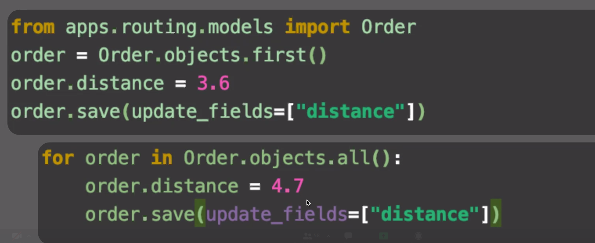
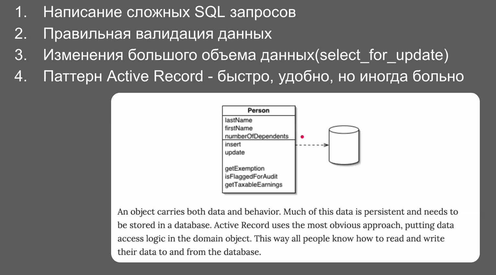
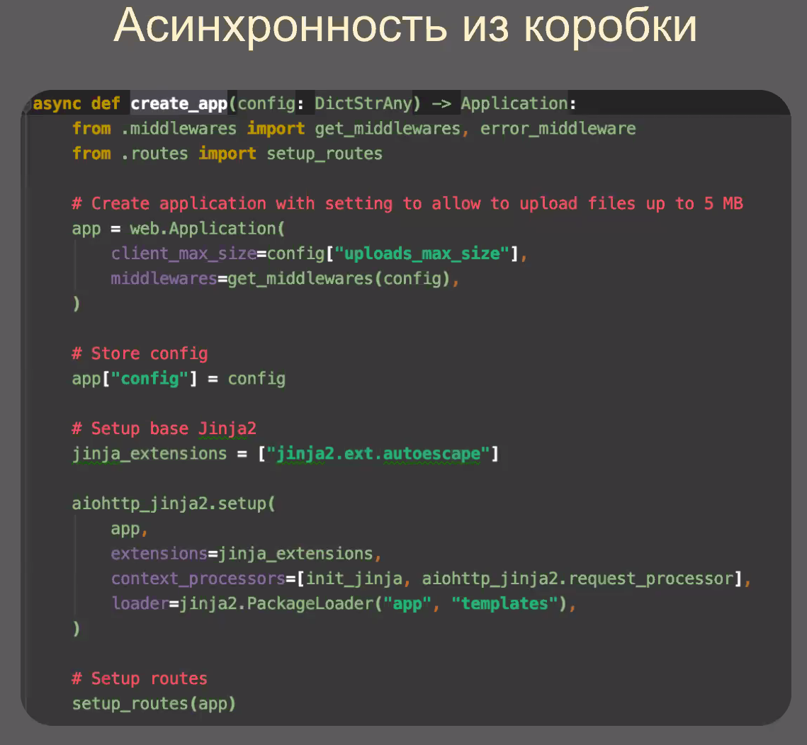
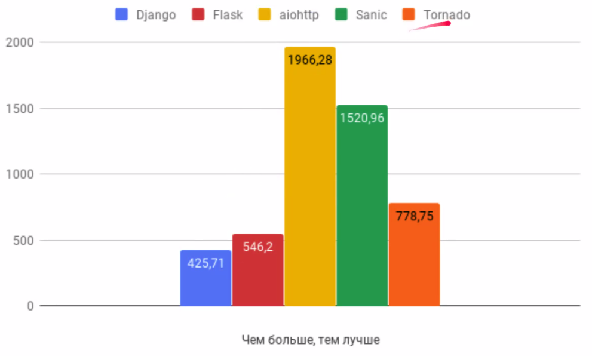

# Yalantis "Web Crowd 8.0"

## Demo

25 лютого Yalantis запрошує веб-розробників на восьму зустріч Web_crowd, яка відбудеться в онлайн-форматі. Мітап буде присвячений темі Python.

## Speakers

- **Михаїл Кашкін**, автор курсів з програмування, співорганізатор PyCon Ukraine, працював з Google, Yandex, Mail.ru, VEON, McKinsey, EY. Зараз керує розробкою банківських додатків в компанії Yalantis на позиції архітектора. Батько чотирьох.

Тема: Python GIL, асинхронність, мультипроцеси: особливості паралельної обробки даних.

- **Валерій Дишлевий**, Python developer в Yalantis, працював в компаніях KeyUA, ISITechnology, Archer Software, OnePlanetOps.

Тема: Django vs aiohttp: порівняння продуктивності.

## 1. Parallel processing in Python by *Михаїл Кашкін*
### Постановка задачи
Представим себе, что есть необходимость обработать большой файл. Каждая строка - отдельный документ (запись).

**Вопрос:** какие средства использовать для обработки файла?

Спикер сошёл с ума: мы хотим разбить файл обработать в блокчейне  .

> Человечество тратит огромное количество ресурсов на расчёт хэшсумм. Блокчейн - анекдот про нашу жизнь. (С) *Михаїл Кашкін*.

Для ```complexity = 5``` нам приходится множество раз итерироваться 720К раз.

Пример из презенташки:



#### Как распаралелить?

### Bruteforce solution

Обход строк файла циклом. Проверяем хэшсумму на необходимое кол-во нулей.
15 млн. проверок.

It's CPU bound задача. На ввод-вывод нагрузка слабая. Большая нагрузка на ЦП.

Лучший способ распаралеливать - запускать на разных ядрах.

### Threads

Когда запускается Python, у него есть 1 ресурс, которым он монопольно владеет - память. Узким горлышком становится GIL. Когда в потоке происходит выполнение логики, он не может работать с памятью не через GIL.


### Asyncio
Есть небольшая особенность. Если мы запускаем какой-то процесс в asyncio, мы запускаем его в режиме одного потока. Почему веб-приложения работают быстрее на асинхронных фреймворках? Суть кроется в работе самих фреймворков и корутин. У корутин есть одно интересное свойство: это обьекты со своими собственными методами. Если мы будем работать с обьектами в Python с помощью протоколов, мы можем осуществить запрос в любой момент в времени. Для этого существует механизм - event loop.

> Python это язык протоколов (С) *Михаїл Кашкін*

В ОС существует отдельный механизм работы с файлами, при котором синхронный код, запрашивающий в ядре доступ к сетевому или файловому сокету, замирает. Асинхронный event loop позволяет обрабатывать вызовы функций ''с прерыванием''. Иначе говоря, мы можем осуществлять обработку других корутин, запросов, пока текущая ждёт ответа от ОС.

Таким образом, т.к. нагрузка на ввод-вывод небольшая, CPU задача не будет быстрее обрабатываться в asyncio.


### Multiprocessing

Правильный ответ: CPU-bound задачу лучше всего обрабатывать разными процессами, скармливая им по частям файл.

> Оффтоп. **Django** - не плох, не хорош. Инструмент для создания блогоподобных сайтов с простой логикой. (C) *Михаїл Кашкін*

> Раньше, чтобы программировать, нужно было иметь очки с большими диоптриями, огромную бороду и белый халат:) ... Сейчас требования к программисту снижаются. (С)  *Михаїл Кашкін*

----------------------------


# Django vs aiohttp

На данный момент существует проект проект, который использует Django, другие фв используются мало. Проект вышел за рамки стартапа, легаси код приходится переносить на микросервисы.

> Проблема на в Django, а в документации и программистах (С)



## Django

### General

- Готовая User model.
 - Которую мы всё равно будем менять.
- Security out of the box.
- Django admin panel.
 - Которую мы всё равно будем менять.
 - И которая имеет проблемы с оптимизацией.
- Запрос ОРМ разбивается на большое кол-во query. В проде тупит.
- raw_id_fields - don't forger about it.
- Django Inlines.
 - Работа с формами и нестандартной логикой - боль.
- Build in migration engine.
- Squash mechanism.
 - Которым нужно уметь пользоваться. При ссылке на application из вне возникают циклические миграции.
 - merge conflicts.
 - используется на CI тестах.


### Django ORM


Работает по принципу **active record**, который нарушает SOLID.

#### Выполняется очень долго:



> Стоит ли пользоваться Django ORM? Проще написать Raw SQL. (C)

#### С Django всё хорошо, пока мы не услышим слово HighLoad.



### А также:

1. Django signals - неявная цепочка событий.
2. Либо много сериалайзеров, либо страдает репрезентация.
3. Медленное развитие фреймворка.

## aiohttp
> Почему не flask? Миша так сказал... (С)

> FastAPI? Не прошел период адаптации ещё. (С)



- Поддерживает вебсокеты.
- Неплохой выбор расширений.
 - pytest.
 - async db drivers.
 - uvloop.
- Gino - Асинхронный драйвер для SQLAlchemy с поддержкой ОРМ.

1. Свобода выбора инструментов тестрирования, бд, сериализации, валидации данных.
2. Скорость работы.
3. Меньше бойлерплейтов и батареек.
4. Надёжность.

### Cons

1. Порог вхождения.
2. Работа с чистыми SQL запросами.
3. Произвольная структура приложения.
4. Нет батареек.

## Benchmark

aiohttp выиграл карманные бои.
С хабра картинка c **rps**, правда довольно устаревшая:


