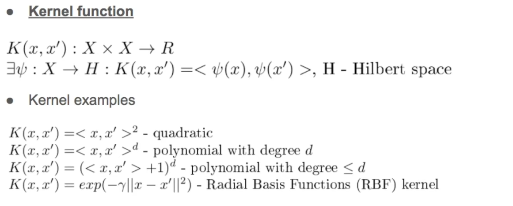

# Classification metrics

### Working with binary classification

- Accurracy - 
- Balanced accuracy - mean of accuracy above each class.
- Precision = 
- Recall = 
- F-score = **min (precision, recall)** - not differentiable.
- F1-score = harmonic mean.
- F- - weighted F1.
- ROC
- ROC-AUC
- Precision-Recall Curve

### Working with multiclass classification

- Confusion matrix

# Nonlinear SVM Kernels

# PCA: Effective dimensionality
We can use **reconstruction loss** to evaluate effective k-param to apply decomposition.

# Cross-validation

#### Naive:

- KFold.

- ShuffleSplit.

#### Considering classes distribution:

- Stratified KFold.

- Stratified ShuffleSplit.

#### Considering similar samples or grouped samples:

- Group KFold.

- Group ShuffleSplit.

For time series - TimeSeriesSplit.
