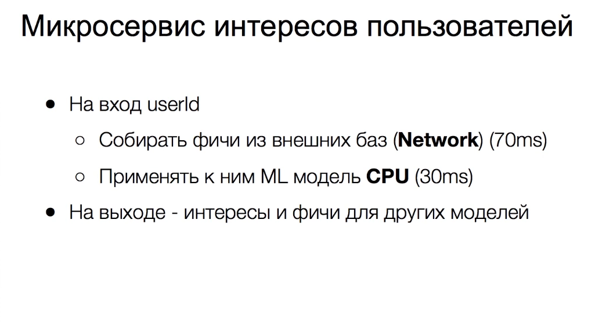
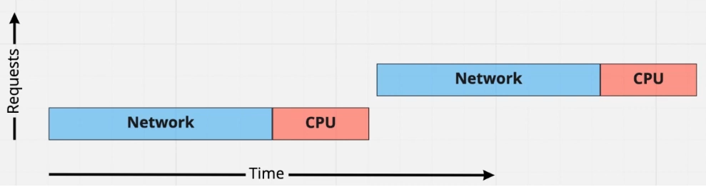
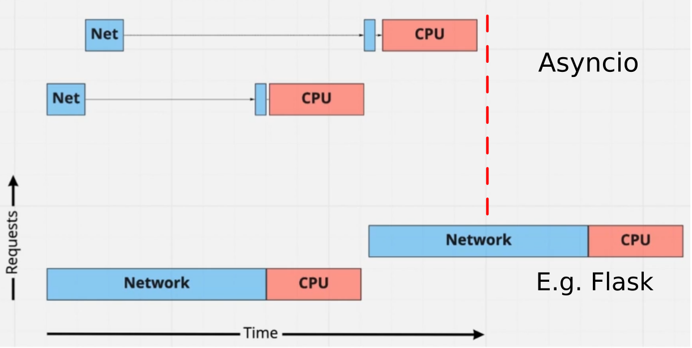
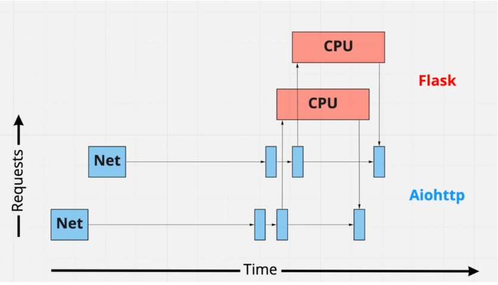
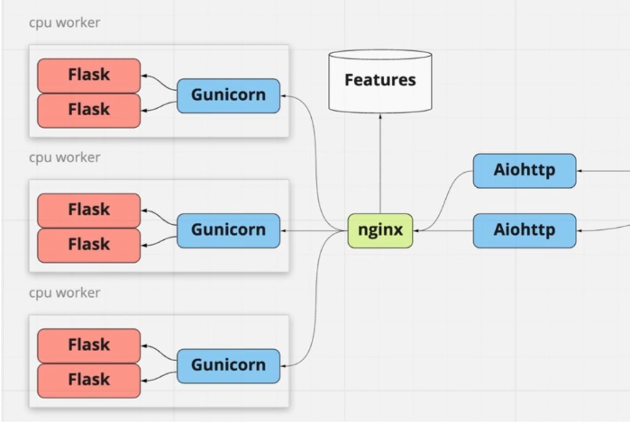
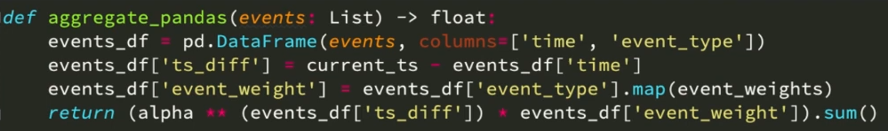

# CPU bound задачи в веб-сервисах на Python
## Постановка задачи
Видео: [Дмитрий Ходаков, Avito «CPU bound задачи в веб-сервисах на Python»](https://www.youtube.com/watch?v=OmBuXb7P9Ak&list=PLRdS-n5seLRrFxA3PDP0JRz7wRLGJ-xu0&index=6)


Представим: есть необходимость создать микросервис интересов пользователей. Данные пользователей хранятся на внешних бд. Нужно вытащить данные по http и применить к ним МЛ-модель. Детальнее на слайде:


### На что стоит обратить внимание

- Отчуждаемость - using jRPC. Хотим использовать из других ЯП.
- Нагрузка и Latency = **1000 rps** on 30ms(CPU) + 70ms(I/O).
- Horizontal scaling.

## Можно сделать всё синхронно
> В целом, если вы пишете код с затратой мыслетоплива N, то потом, чтобы отладить и заставить это хорошо работать, понадобится 10 N. Если же вы пишете код на приделе своих умственных возможностей, то отладить это будет невозможно. (С) Дмитрий Ходаков

Совсем примитивный подход. Возьмём любой WSGI framework:
``` python
def process_request_sync(user_id):
    features = session.post(feature_service_url,
                            json={'user_id': user_id})

    preprocessed_features = processor.preprocess(features)
    score = model.infer(preprocessed_features)
    return score
```

Что получим в результате во время профилирования:


**10 запросов в секунду** с 1 CPU.
## Виды многозадачности
- Вытесняющая - прерывание работы worker'a.
    - Threads
    - Process
- Кооперативная - метод флагов - ожидаем переход в неблокирующий режим.
    - Eventloop - async & await
    - non-blocking sockets

## Asyncio + CPU-bound
``` python
async def process_request(user_id):
    async with session.post(feature_service_url,
                            json={'user_id': user_id}) as resp:
        features = await resp.json()

    preprocessed_features = processor.preprocess(features)
    score = model.infer(preprocessed_features)
    return score
```
Каждый сетевой вызов разделился на 2. В результате:


Но так же, получаем побочный эффект: во время сетевого вызова может вклиниться CPU вызов и заблокировать операции. Таким образом, общее *Latence* возрастёт.
Время в различных перцентилях начинает "прыгать". Чем более загружен ивентлуп, тем больше будет возрастать загруженность.

## Разделение сервисов
Микросервис будет "обрастать" фичами. Добавится логгирование, кэширование, другие сетевые вызовы. Знаменитый подход: разделим функциональность на 2 части:

- Синхронный код на *Flask*.
- Асинхронный код с сетевыми запросами на *Aiohttp*.

Результат:


Инициализация запросов на *aiohttp* происходит довольно быстро. При желании, можно нагрузить 1-ядерный сервис до 1К рпс без деградации. Flask будет масштабироваться линейно. Дальнейшая оптимизация возможна только на уровне модели.

Если раньше мы плодили worker'a который занимался различными задачами, то теперь совершенно разные части масштабируются независимо.



#### +
- Полностью раздельное масштабирование
- Выделенный RPC для синхронного сервиса

#### -
- Distinct code bases. Need to mantain 2 microservices.
- +1 Network hop. Network isn't stable
- Difficult to add new I/O + CPU links. Structure isn't elastic.

## Join I/O + CPU
Существует ```Concurrent.futures``` с *ProcessPoolExecutor*. Данный интерфейс хорошо подходит к корутинам *asyncio*. Заведём свой пулл процессов и отдавать им задачи, которые блокируют ивентлуп.

``` python
executor = concurrent.futures.ProcessPoolExecutor(max_workers=N)

def predict(features):
    preprocessed_features = processor.preprocess(feature
    return model.infer(preprocessed_features)

async def process_request(user_id):
    async with session.post(feature_service_url,
                            json={'user_id': user_id}) as resp:
        features = await resp.json()

    return await loop.run_in_executor(executor, predict(features))
```

*ProcessPoolExecutor* скрывает машинерию выполнения задач. Главное, что теперь мы не блокируемся на выполнении *CPU* нагрузки.

*ProcessPoolExecutor* не бесплатный. Внутри тяжелый функционал работы посредством сетевых вызовов.

#### +
- Меньше накладных расходов на RPC (*)
- Можно добавлять новые сочетания I/O + CPU

#### -

- Сложности в отладке

Мы получили 2 различных решения, которые позже сравним.

## Pandas доверяй - сам проверяй
В ходе разработки возникло следующее решение:


Что мы видим: функция, которая агрегирует ивенты пользователя и возвращает результат выполнения некой математической операции. При этом решение использовать ```pandas```, ```numpy``` приходит само собой. Но есть нюанс. Выполнив профилирование, увидим, что на выполнение данной функции уходит более 300ms. Если напишем подобную функцию на чистом питоне:


Получили **в 50 раз быстрее**.

## Summary and contacts


