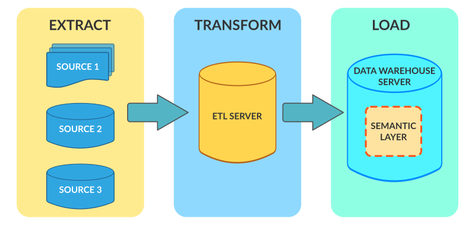
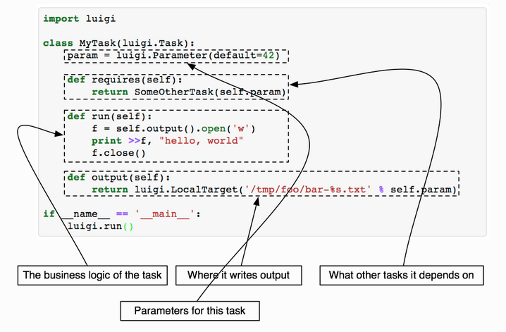

# ETL инструменты в экосистеме Python
Видео: [Адиль Хаштамов, Playrix «ETL инструменты в экосистеме Python»](https://www.youtube.com/watch?v=PLBDvZX6tFU&list=PLRdS-n5seLRrFxA3PDP0JRz7wRLGJ-xu0&index=5)

**ETL** = Extract Transform Load



### Non-ETL ways of solving data issues

- Custom scripts.
- Manual deploy.
- ```cron``` scheduling.

This approach cause many **problems** such as:
- Increasing number of tasks.
- Dependency between tasks.
- No monitoring.
- No retry mechanism.
- fault tolerance.


> Не нужно изобретать велосипеды (С) Адиль Хаштамовx
----------------------
## Luigi

### Short description

- Developed by Spotify in 2012.

- **Supports**: S3, Redshift, Hadoop, Spark, PostgreSQL, Kubernetes.

- retry mechanism.

- easy dependency determination,

- notifications and webhooks.

- small code base.

Main instance in Luigi is a **Task**. This is an object that stores description of execution logic. Final result of **Task** is **Target**.

#### Target

Defined in ```output``` method of the *Task* class. Predefined **Target's**: LocalTarget, S3Target, RedshiftTarget.

#### Sample Luigi Task


### Luigi web UI
Key Luigi feature. Written on **Tornado** framework. Builds dependency graph.

### Disadvantages

- No scheduler:
 - cron
 - Cloud Watch
- Tornado coordinator - bottleneck. (problems with scaling)

-----------------------
## Apache Airflow
Developed by Airbnb (Maxime Beauchemin).

Airflow = Flask Application + Celery (recommended)

### Advantages

- Convenient UI with scheduler, database and logs, dependency graph.
- Secured (encrypted) **config storage**.
- Easy to scale with queues (Celery/Dask).
- Ready-to-Use code for Redshift, Hadoop, Bash, Python.
- GCP: **Composer**.

### Disadvantages
- Celery - huge instrument. Depends on broker.
- Complicated instrument.
- Not so agile:)

### DAG ( Directed Acyclic Graph)
Incapsulates tasks( **operators**) with relations and dependencies.

### Operator

- Luigi **Task** analog.
- Accepts many Predefined operators: PythonOperator, BashOperator, RedshiftOperator, etc.
- Have to be idempotent. Apache Airflow can retry your task... or use Catchup&Backfill mechanism [Read more...](https://medium.com/nerd-for-tech/airflow-catchup-backfill-demystified-355def1b6f92)
- Action Operator, Transfer Operator, Sensor Operator.

### Sensor

*Sensor* - type of Operator. Handy for event-driven development. S3Sensor, PythonSensor and RedisPubSensor available.

-------------------
## Prefect
By Airflow and Dusk developers. Still crude.
> Dask = Pandas на стироидах.

Implements classes:
- Flow
- Task
- Signals, Triggers

#### Very pythonic style.
-----------------
## How to prepare ETL by example


- Serverless Luigi.
- Luigi on Lambda with DynamoDB state.
- Docker workets on AWS ECS Fargate (*to pay less* ).
- **CloudWatch** as scheduler and task trigger ( CloudWatch Logs).
- schedule in YAML.
- Deploy through CloudFormation.
- Monitoring in Slack.
