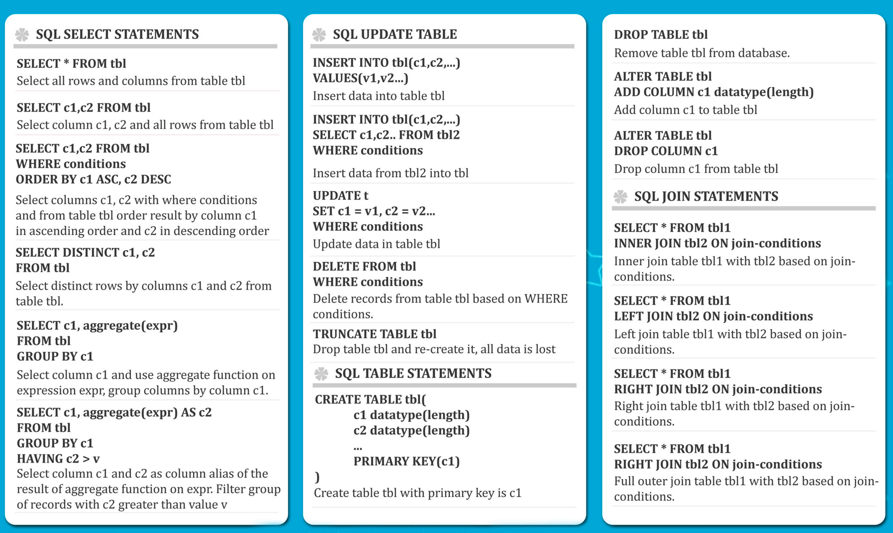
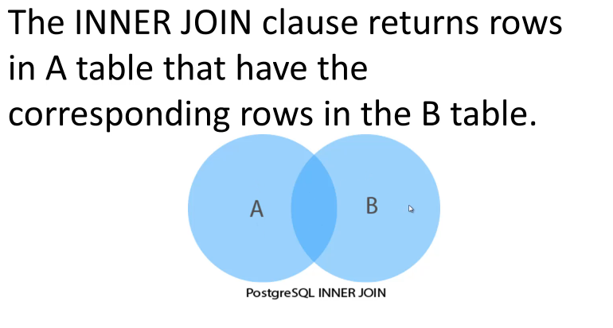

## SQL Basics

### Psql commands

- **\?** - help.
- **\i path-to-file.sql** - execute from file.
- **\c** - connect 2 db.
- **\l** - lists db's.
- **\d** - list of tables and relations.
- **\dt** - lists only tables.
- **\d table** - list specific table.

### Tables and db's
``` sql
CREATE DATABASE sample;
DROP DATABASE sample;

CREATE TABLE table_name(
  columns
);

CREATE TABLE person (
  id BIGSERIAL NOT NULL PRIMARY KEY,
  first_name VARCHAR(50),
  date_of_birth DATE NOT NULL
);

DROP TABLE person;
```
### Insert
``` sql
INSERT INTO table(column_name) VALUES ('value1');

-- Example:
INSERT INTO person(first_name, last_name, date_of_birth)
VALUES ('Anne', 'Smith', date '1988-01-09');
 ```
### Select
#### Common select
``` sql
-- select all
SELECT * FROM table; -- bad practice
SELECT first_name, last_name FROM person;
```
#### Distinct select
```DISTINCT``` keyword can be used to return only distinct (different) values.

For example, selecting only **unique** values of *field1*:
``` sql
SELECT DISTINCT field1 FROM sample_table;
```


### Order by, Where Clause and AND
``` sql
-- common order query
  SELECT * FROM table ORDER BY column_name ASC;
  SELECT * FROM table ORDER BY column_name DESC;
-- order with leveling
  SELECT field1, field2 FROM sample_table
  ORDER BY field1 ASC, field2 DESC;

-- where statement
  SELECT * FROM table WHERE column_name = 'value';
-- where with logic operations
  SELECT * FROM table WHERE column_name1 = 'value1' AND
  (col_name2 = 'value2' OR col_name3 = 'value3');

  -- not equal operation:
  1 <> 2;
```
### Limits
Sets the max count of result rows.
``` sql
-- returns first 5 rows
SELECT * FROM table LIMIT 5;

-- returns from 6th to 10th rows
SELECT * FROM table OFFSET 5 LIMIT 5;

-- do the same: SQL standard
SELECT * FROM table OFFSET 5 FETCH FIRST 5 ROW ONLY;
```

### In, Between, Like, iLike
``` sql
-- one of list values
SELECT * FROM table WHERE field IN ('Value1', 'Value2', 'Value3');

-- between values
SELECT * FROM table WHERE date_of_birth BETWEEN DATE '2000-01-01' AND '2015-01-01';

-- prefix or suffix string match
SELECT * FROM table WHERE field LIKE '%suffix';
SELECT * FROM table WHERE field LIKE 'prefix%';
SELECT * FROM table WHERE field LIKE '%both%';
SELECT * FROM table WHERE field LIKE '_1char';

-- NOT case sensitive
SELECT * FROM table WHERE field ILIKE 'pREfix%';
```
**'_' in LIKE** expression matches single char.

---------------------

### Cheat sheet



-----------------------------

### COUNT Statement
Returns number of rows or amount of **non-null** values in ```SELECT``` statement result.

``` sql
-- count rows
SELECT COUNT(*) FROM table;

-- using alongside with DISTINCT keyword
SELECT COUNT(DISTINCT(column)) FROM table;
```

----------------------------------
## Aggregate Functions
### Overview
Aggregate functions compute a single result from a set of input values. The built-in general-purpose aggregate functions are listed in [Official Postgres Documentation](https://www.postgresql.org/docs/13/functions-aggregate.html).

Grouping operations, which are closely related to aggregate functions, are listed in [Table 9.59 ](https://www.postgresql.org/docs/current/functions-aggregate.html#FUNCTIONS-GROUPING-TABLE)

It should be noted that except for count, these functions return a **null value** when no rows are selected. In particular, sum of no rows returns null, not zero as one might expect, and array_agg returns null rather than an empty array when there are no input rows.


[Table 9.56](https://www.postgresql.org/docs/current/functions-aggregate.html#FUNCTIONS-AGGREGATE-STATISTICS-TABLE) shows aggregate functions typically used in statistical analysis.

### Grouping Operations

``` sql
GROUPING ( group_by_expression(s) ) → integer
```
Returns a bit mask indicating which GROUP BY expressions are not included in the current grouping set. Bits are assigned with the rightmost argument corresponding to the least-significant bit; each bit is 0 if the corresponding expression is included in the grouping criteria of the grouping set generating the current result row, and 1 if it is not included.

#### Example
``` sql
=> SELECT * FROM items_sold;
 make  | model | sales
-------+-------+-------
 Foo   | GT    |  10
 Foo   | Tour  |  20
 Bar   | City  |  15
 Bar   | Sport |  5
(4 rows)

=> SELECT make, model, GROUPING(make,model), sum(sales) FROM items_sold GROUP BY ROLLUP(make,model);

 make  | model | grouping | sum
-------+-------+----------+-----
 Foo   | GT    |        0 | 10
 Foo   | Tour  |        0 | 20
 Bar   | City  |        0 | 15
 Bar   | Sport |        0 | 5
 Foo   |       |        1 | 30
 Bar   |       |        1 | 20
       |       |        3 | 50
(7 rows)
```
### Examples of aggregate functions

#### AVG
Returns **average** of selected field or grouped set of fields.

``` sql
SELECT AVG(num_field) FROM sample_table;
-- for example we get 4.123456 as a result
```
Additionally, you can use ```ROUND``` method:
``` sql
SELECT ROUND(AVG(num_field), 3) FROM payment;
-- ang here we get 4.123 as a result
```
#### MIN
``` sql
SELECT day, MIN(temp) FROM inspection GROUP BY day;
```
#### MAX
``` sql
SELECT day, MAX(temp) FROM inspection GROUP BY day;
```
#### SUM
``` sql
SELECT type, SUM(price) FROM payment GROUP BY type;
```
#### COUNT
``` sql
SELECT customer_id, COUNT(*) FROM order GROUP BY customer_id;
```
### HAVING clause

We often user ```HAVING``` clause in conjunction with the ```GROUP BY``` clause to filter group rows that do not satisfy a specified condition.

The ```HAVING``` clause sets the condition for group rows created by the ```GROUP BY``` clause after the ```GROUP BY``` clause applies. In other hand, the ```WHERE``` clause sets the condition for individual rows **before** ```GROUP BY``` clause applies.
#### Using template
``` sql
SELECT column_1, agg_func(column_2)
FROM table
GROUP BY column_1
HAVING condition;
```
----------------------------
## Advanced SQL commands
### AS statement

**AS** statement allows to rename columns or table selections with alias. Usage:

- Select alias from column.

``` sql
SELECT col_string AS name FROM table1;
```

- Select alias from tables.

``` sql
SELECT users.col_id AS user_id,
  users.col_string AS name,
  info.col_string AS address
  FROM table1 AS users,
  table2 AS info
  WHERE users.col_id = info.col_id;
```

### Joins

Joins allow to relate data in one table to other.

#### INNER JOIN

``` sql
SELECT A.primary_key,
  A.field1,
  B.primary_key,
  B.field2
FROM A
INNER JOIN B ON A.primary_key = B.f_key;
```
If db finds a match by the condition, it combines columns of both rows into one row and add the combined row to the returned result set.

To avoid ambiguity, it's better to specify column name.


