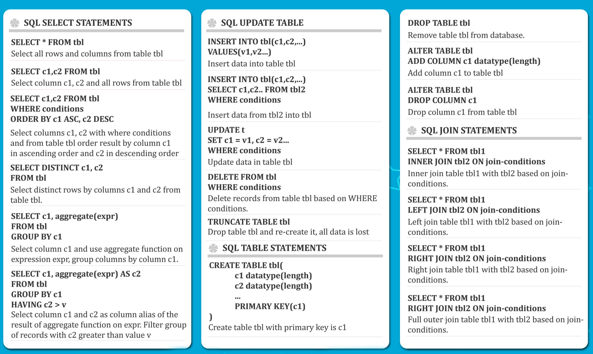

# PosqtgreSQL

### Psql commands

- **\?** - help.
- **\i path-to-file.sql** - execute from file.
- **\c** - connect 2 db.
- **\l** - lists db's.
- **\d** - list of tables and relations.
- **\dt** - lists only tables.
- **\d table** - list specific table.

### Tables and db's
``` sql
CREATE DATABASE sample;
DROP DATABASE sample;

CREATE TABLE table_name(
  columns
);

CREATE TABLE person (
  id BIGSERIAL NOT NULL PRIMARY KEY,
  first_name VARCHAR(50),
  date_of_birth DATE NOT NULL
);

DROP TABLE person;
```
### Insert
``` sql
INSERT INTO table(column_name) VALUES ('value1');

-- Example:
INSERT INTO person(first_name, last_name, date_of_birth)
VALUES ('Anne', 'Smith', date '1988-01-09');
 ```
### Select
#### Common select
``` sql
-- select all
SELECT * FROM table; -- bad practice
SELECT first_name, last_name FROM person;
```
#### Distinct select
```DISTINCT``` keyword can be used to return only distinct (different) values.

For example, selecting only **unique** values of *field1*:
``` sql
SELECT DISTINCT field1 FROM sample_table;
```


### Order by, Where Clause and AND
``` sql
-- common order query
  SELECT * FROM table ORDER BY column_name ASC;
  SELECT * FROM table ORDER BY column_name DESC;
-- order with leveling
  SELECT field1, field2 FROM sample_table
  ORDER BY field1 ASC, field2 DESC;

-- where statement
  SELECT * FROM table WHERE column_name = 'value';
-- where with logic operations
  SELECT * FROM table WHERE column_name1 = 'value1' AND
  (col_name2 = 'value2' OR col_name3 = 'value3');

  -- not equal operation:
  1 <> 2;
```
### Limits
Sets the max count of result rows.
``` sql
-- returns first 5 rows
SELECT * FROM table LIMIT 5;

-- returns from 6th to 10th rows
SELECT * FROM table OFFSET 5 LIMIT 5;

-- do the same: SQL standard
SELECT * FROM table OFFSET 5 FETCH FIRST 5 ROW ONLY;
```

### In, Between, Like, iLike
``` sql
-- one of list values
SELECT * FROM table WHERE field IN ('Value1', 'Value2', 'Value3');

-- between values
SELECT * FROM table WHERE date_of_birth BETWEEN DATE '2000-01-01' AND '2015-01-01';

-- prefix or suffix string match
SELECT * FROM table WHERE field LIKE '%suffix';
SELECT * FROM table WHERE field LIKE 'prefix%';
SELECT * FROM table WHERE field LIKE '%both%';
SELECT * FROM table WHERE field LIKE '_1char';

-- NOT case sensitive
SELECT * FROM table WHERE field ILIKE 'pREfix%';
```
**'_' in LIKE** expression matches single char.

---------------------

## Cheat sheet



-----------------------------

## COUNT Statement
Returns number of rows or amount of **non-null** values in ```SELECT``` statement result.

``` sql
-- count rows
SELECT COUNT(*) FROM table;

-- using alongside with DISTINCT keyword
SELECT COUNT(DISTINCT(column)) FROM table;
```
