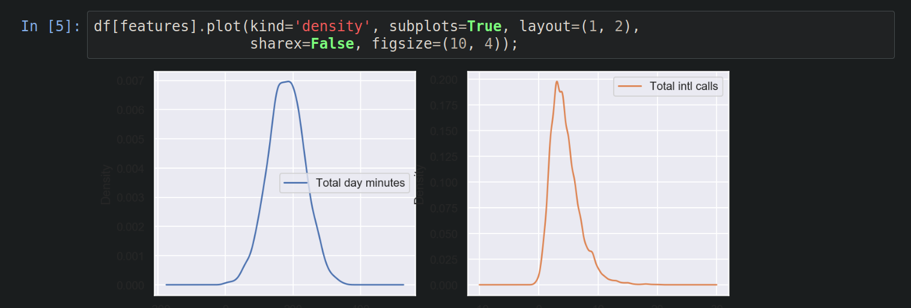
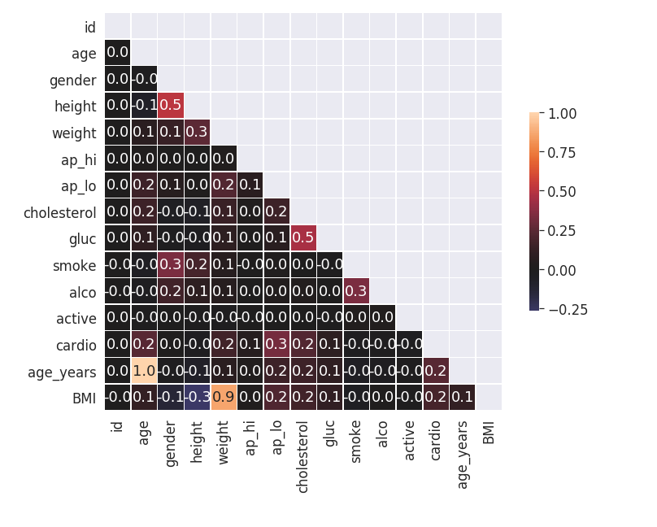
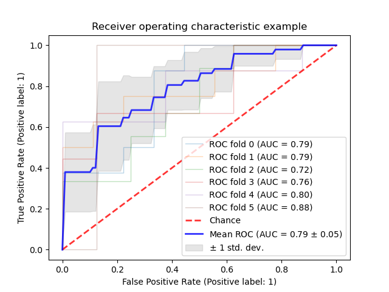

# Visual data analysis in Python
*by mlcourse.ai*

## Initilizing and first steps
Exclude warnings from output:
``` python
import warnings
warnings.filterwarnings('ignore')
```
Setting the seaborn:
``` python
import seaborn as sns
sns.set()
```
Graphics in retina format are more sharp and legible:
``` python
%config InlineBackend.figure_format = 'retina'
```

**Univariate analysis** looks at one feature at a time. When we analyze a feature independently, we are usually mostly interested in the distribution of its values and ignore other features in the dataset.

## Univariate visualization

#### DataFrame built-in histogram

We can call hist method of column or set of columns:
``` python
DataFrame.hist(column=None, by=None, grid=True,
               xlabelsize=None, xrot=None, ylabelsize=None,
               yrot=None, ax=None, sharex=False, sharey=False,
               figsize=None, layout=None, bins=10,
               backend=None, legend=False, **kwargs)
```
#### Density plot

This is smoothest version of histogram. E.g. 2 features:




#### distplot
With seaborn both histogram and density could be mapped by:
``` python
sns.distplot(dataframe["example_feature"])
```

#### boxplot
The main component is the box, whiskers and outliers(number of individual points).

**Components description**
- Box - interquartile spread - [Q1, Q3].
- Vertical line inside the box - the median.
- Whiskers - [Q1 - 1.5 IQR , Q3 + 1.5 IQR].
- outliers - individual points.

#### violin plot
``` python
# for comparison
sns.boxpot(data=df["col1"], ax=axes1)

# we could pass axes from matplotlib subplot to sns
sns.violinplot(data=df["col2"], ax=axes2)
```
#### Barplot
The bar plot is a graphical representation of the frequency table. The easiest way to create it is to use the seaborn's function ```countplot()```.

## Multivariate visualization

#### correlation matrix

First, we will use the method ```corr()``` on a **DataFrame** that calculates the correlation between each pair of features. Then, we pass the resulting correlation matrix to ```heatmap()``` from **seaborn**, which renders a color-coded matrix for the provided values.
``` python
cns.heatmap(df[numerical_cols].corr())
```

#### scatter plot
Just points in 2D.
``` python
plt.scatter(x,y)s
```
Slightly fancier with sns:
``` python
sns.joinplot(x='col_x', y='col_y', data=dataframe, kind="scatter")
```

-----------------------------------------------------
## Beautiful correlation matrix


``` python

# Calculate the correlation matrix
corr = df.corr(method='pearson')

# Create a mask to hide the upper triangle of the correlation matrix (which is symmetric)
mask = np.zeros_like(corr, dtype=np.bool)
mask[np.triu_indices_from(mask)] = True

f, ax = plt.subplots(figsize=(12, 9))

sns.heatmap(corr, mask=mask, vmax=1, center=0, annot=True, fmt='.1f',
            square=True, linewidths=.5, cbar_kws={"shrink": .5});
```


------------------------------------------


## Receiver Operating Characteristic (ROC) with cross validation

Example of Receiver Operating Characteristic (ROC) metric to evaluate classifier output quality using cross-validation.

ROC curves typically feature true positive rate on the Y axis, and false positive rate on the X axis. This means that the top left corner of the plot is the “ideal” point - a false positive rate of zero, and a true positive rate of one. This is not very realistic, but it does mean that a larger area under the curve (AUC) is usually better.

[More details...](https://scikit-learn.org/stable/auto_examples/model_selection/plot_roc_crossval.html#sphx-glr-auto-examples-model-selection-plot-roc-crossval-py)
``` python
import numpy as np
import matplotlib.pyplot as plt

from sklearn import svm, datasets
from sklearn.metrics import auc
from sklearn.metrics import plot_roc_curve
from sklearn.model_selection import StratifiedKFold

            .  .  .

            .  .  .

cv = StratifiedKFold(n_splits=6)
classifier = svm.SVC(kernel='linear', probability=True,
                     random_state=random_state)

tprs = []https://scikit-learn.org/stable/auto_examples/model_selection/plot_roc_crossval.html#sphx-glr-auto-examples-model-selection-plot-roc-crossval-py
aucs = []
mean_fpr = np.linspace(0, 1, 100)

fig, ax = plt.subplots()
for i, (train, test) in enumerate(cv.split(X, y)):
    classifier.fit(X[train], y[train])
    viz = plot_roc_curve(classifier, X[test], y[test],
                         name='ROC fold {}'.format(i),
                         alpha=0.3, lw=1, ax=ax)
    interp_tpr = np.interp(mean_fpr, viz.fpr, viz.tpr)
    interp_tpr[0] = 0.0
    tprs.append(interp_tpr)
    aucs.append(viz.roc_auc)

ax.plot([0, 1], [0, 1], linestyle='--', lw=2, color='r',
        label='Chance', alpha=.8)

mean_tpr = np.mean(tprs, axis=0)
mean_tpr[-1] = 1.0
mean_auc = auc(mean_fpr, mean_tpr)
std_auc = np.std(aucs)
ax.plot(mean_fpr, mean_tpr, color='b',
        label=r'Mean ROC (AUC = %0.2f $\pm$ %0.2f)' % (mean_auc, std_auc),
        lw=2, alpha=.8)

std_tpr = np.std(tprs, axis=0)
tprs_upper = np.minimum(mean_tpr + std_tpr, 1)
tprs_lower = np.maximum(mean_tpr - std_tpr, 0)
ax.fill_between(mean_fpr, tprs_lower, tprs_upper, color='grey', alpha=.2,
                label=r'$\pm$ 1 std. dev.')

ax.set(xlim=[-0.05, 1.05], ylim=[-0.05, 1.05],
       title="Receiver operating characteristic example")
ax.legend(loc="lower right")
plt.show()
```


